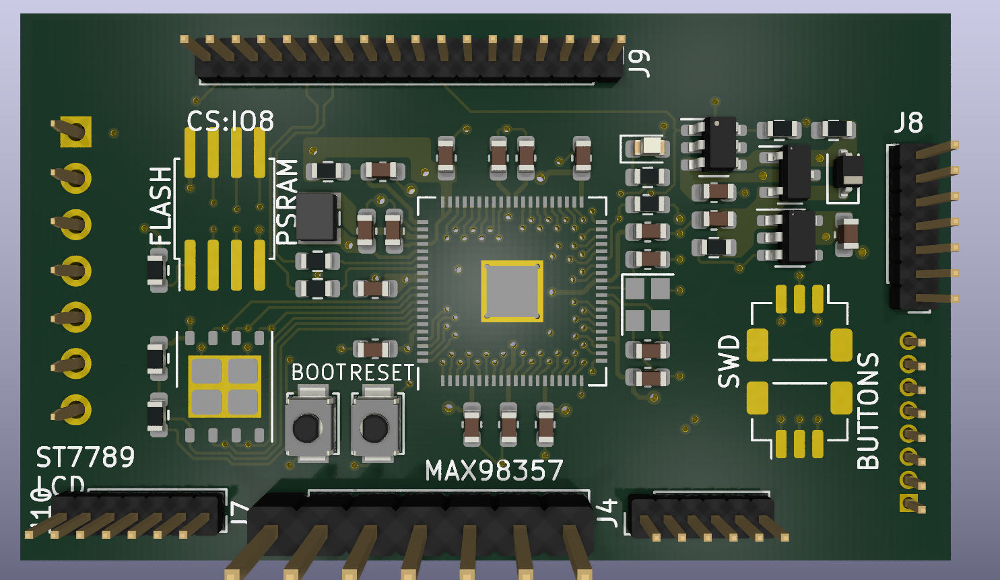
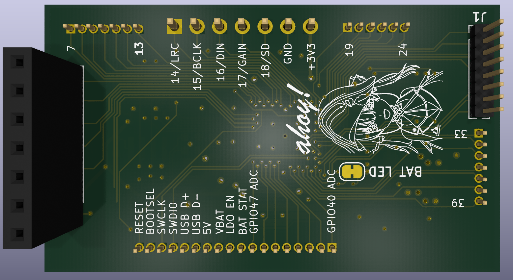
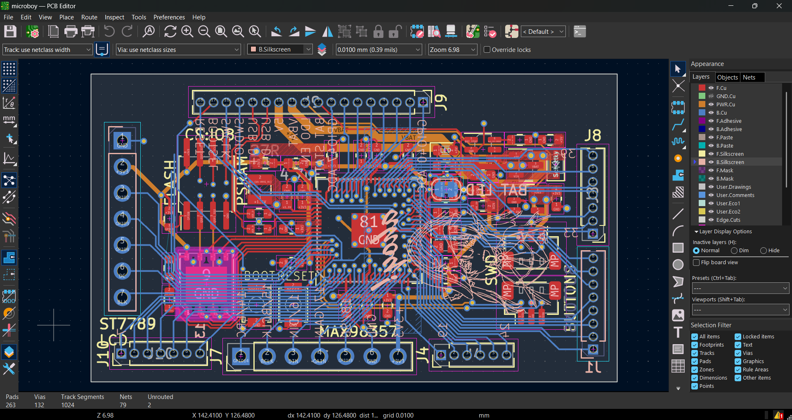
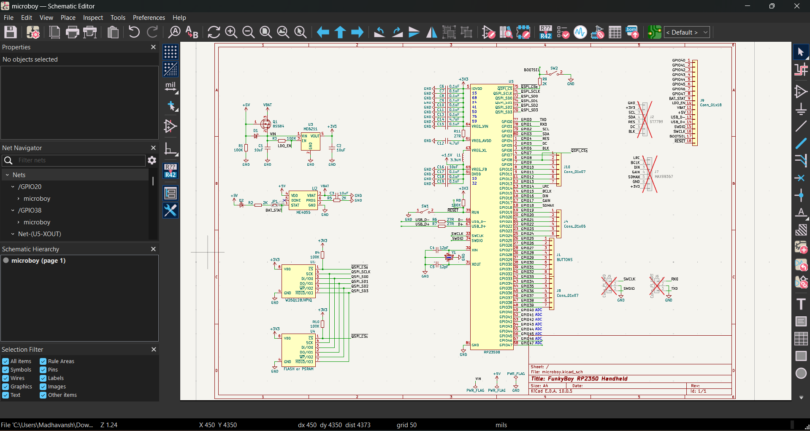

# funkyboi
a funky chonky handheld gba clone

he's a work in progress, please bear with him

## What is this?
like you read, a gba clone. its meant to be as small in form factor as possible, and currently i've nearly achieved this. 
it borrows from the solderparty stamp xl in form of the schematic, but pcb was remade because it wouldn't open for me for some reason. some differences between those and this are:
- lack of castelled edge based breakout (swapped to normal through holes)
- no proper power plane or signal plane (i have no idea how those work, i only know ground copper pour)
- power network significantly changed to be more unified (arguably, more unstable, but throw on some 100nf capacitors and it fixes everything.)
- the obvious gamer setup

## Parts used
please refer to "BOM reference.csv". Has everything for now,

## Journal.md
included please check

## Photos

yes i know the elephant in the room is the big red cross marks
they're marked do not populate because i want to leave the headers alone until i need them and for the actual parts that'll be needed i'll hand solder what i can

## Thanks
to you for coming here
